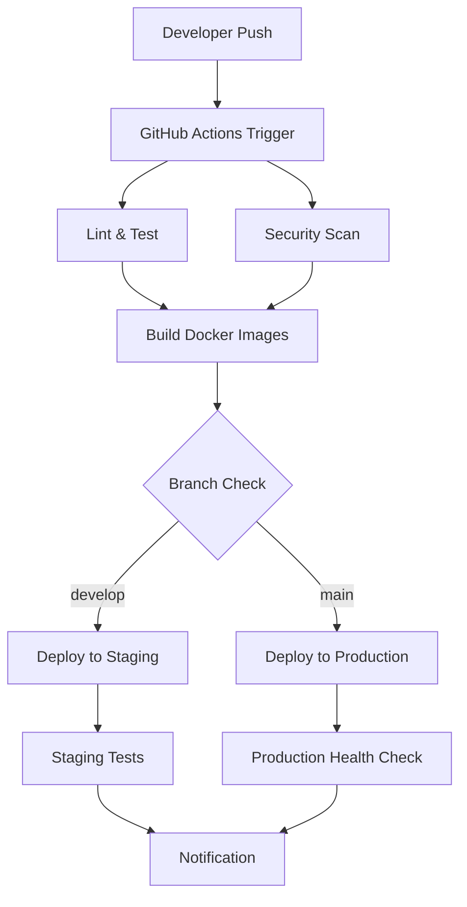

# CI/CD Pipeline Documentation

## Overview

This document describes the Continuous Integration and Continuous Deployment (CI/CD) pipeline for the T4G Urban Loyalty Game project.

## Pipeline Architecture



## Workflows

### 1. Main CI/CD Pipeline (`ci-cd.yml`)

**Triggers:**
- Push to `main`, `develop`, `staging` branches
- Pull requests to `main`, `develop`
- Manual dispatch

**Jobs:**
1. **Lint & Test** - Code quality checks and testing
2. **Security Scan** - Vulnerability scanning with Trivy
3. **Build** - Docker image building and pushing
4. **Deploy Staging** - Automatic deployment to staging (develop branch)
5. **Deploy Production** - Automatic deployment to production (main branch)
6. **Notify** - Team notifications via Slack

### 2. Database Migration (`database-migration.yml`)

**Triggers:**
- Manual dispatch only

**Features:**
- Choose target environment (staging/production)
- Choose migration action (run/generate/revert/show)
- Dry run option for staging
- Verification steps

### 3. Performance Testing (`performance-testing.yml`)

**Triggers:**
- Daily schedule (2 AM)
- Manual dispatch

**Tests:**
- API load testing with k6
- Frontend performance audit with Lighthouse
- Database performance testing

## Branch Strategy

### Development Flow
```
feature/xyz → develop → staging → main → production
```

### Branch Policies
- **`main`**: Production-ready code, protected, requires PR reviews
- **`develop`**: Integration branch, auto-deploys to staging
- **`staging`**: Release candidates, manual promotion
- **`feature/*`**: Feature development branches

## Environments

### Staging Environment
- **URL**: `https://staging.t4g-game.com`
- **API**: `https://api-staging.t4g-game.com`
- **Deploy**: Auto on push to `develop`
- **Database**: Staging PostgreSQL instance
- **Purpose**: Testing, QA, stakeholder reviews

### Production Environment
- **URL**: `https://t4g-game.com`
- **API**: `https://api.t4g-game.com`
- **Deploy**: Auto on push to `main`
- **Database**: Production PostgreSQL instance
- **Purpose**: Live application

## Required Secrets

### Repository Secrets

#### GitHub Container Registry
```bash
# Automatically available
GITHUB_TOKEN
```

#### Staging Environment
```bash
STAGING_HOST=staging.yourdomain.com
STAGING_USERNAME=deploy
STAGING_DEPLOY_KEY=<ssh-private-key>
STAGING_URL=https://staging.t4g-game.com
STAGING_DATABASE_URL=postgresql://...
```

#### Production Environment
```bash
PRODUCTION_HOST=production.yourdomain.com
PRODUCTION_USERNAME=deploy
PRODUCTION_DEPLOY_KEY=<ssh-private-key>
PRODUCTION_URL=https://t4g-game.com
PRODUCTION_DATABASE_URL=postgresql://...
```

#### Database Secrets
```bash
DATABASE_URL=postgresql://...
POSTGRES_HOST=your-db-host
POSTGRES_PORT=5432
POSTGRES_USERNAME=t4g_user
POSTGRES_PASSWORD=secure_password
POSTGRES_DATABASE=t4g_database
```

#### External Services
```bash
SLACK_WEBHOOK=https://hooks.slack.com/...
CODECOV_TOKEN=your-codecov-token
SENTRY_DSN=https://...@sentry.io/...
LHCI_GITHUB_APP_TOKEN=your-lighthouse-token
```

## Setup Instructions

### 1. Enable GitHub Actions
1. Go to repository Settings → Actions → General
2. Enable "Allow all actions and reusable workflows"
3. Set workflow permissions to "Read and write permissions"

### 2. Configure Secrets
1. Go to Settings → Secrets and variables → Actions
2. Add all required secrets listed above
3. Verify secret names match exactly

### 3. Set Up Environments
1. Go to Settings → Environments
2. Create `staging` and `production` environments
3. Configure protection rules:
   - **Staging**: No restrictions
   - **Production**: Required reviewers, deployment branches

### 4. Configure Branch Protection
1. Go to Settings → Branches
2. Add protection rule for `main`:
   - Require pull request reviews (2 reviewers)
   - Require status checks
   - Require branches to be up to date
   - Include administrators

### 5. Set Up Server Infrastructure

#### Docker Host Setup
```bash
# Install Docker and Docker Compose
curl -fsSL https://get.docker.com -o get-docker.sh
sh get-docker.sh
sudo usermod -aG docker $USER

# Create deployment user
sudo useradd -m -s /bin/bash deploy
sudo usermod -aG docker deploy

# Set up SSH keys
sudo -u deploy mkdir -p /home/deploy/.ssh
sudo -u deploy ssh-keygen -t ed25519 -C "deploy@t4g-game.com"
# Add public key to GitHub Deploy Keys
# Add private key to GitHub Secrets
```

#### Nginx Reverse Proxy (Optional)
```nginx
server {
    listen 80;
    server_name t4g-game.com www.t4g-game.com;
    return 301 https://$server_name$request_uri;
}

server {
    listen 443 ssl http2;
    server_name t4g-game.com www.t4g-game.com;

    ssl_certificate /etc/letsencrypt/live/t4g-game.com/fullchain.pem;
    ssl_certificate_key /etc/letsencrypt/live/t4g-game.com/privkey.pem;

    location / {
        proxy_pass http://localhost:3000;
        proxy_set_header Host $host;
        proxy_set_header X-Real-IP $remote_addr;
    }

    location /api {
        proxy_pass http://localhost:3001;
        proxy_set_header Host $host;
        proxy_set_header X-Real-IP $remote_addr;
    }
}
```

## Monitoring & Alerting

### Health Checks
- **API**: `/api/health` endpoint
- **Database**: Connection and query tests
- **Redis**: Connection test
- **Docker**: Container health checks

### Notifications
- **Slack**: `#t4g-deployments` channel
- **Email**: Critical failures only
- **GitHub**: Status badges in README

### Metrics Collection
- **Performance**: Lighthouse CI scores
- **Load Testing**: k6 metrics
- **Error Tracking**: Sentry integration
- **Uptime**: External monitoring service

## Troubleshooting

### Common Issues

#### Build Failures
```bash
# Check build logs
gh run list --repo owner/repo
gh run view <run-id> --log

# Common fixes
- Clear npm cache
- Update lockfile
- Check environment variables
```

#### Deployment Failures
```bash
# Check server logs
ssh deploy@server "docker-compose logs"

# Check disk space
ssh deploy@server "df -h"

# Restart services
ssh deploy@server "cd /opt/t4g && docker-compose restart"
```

#### Database Migration Issues
```bash
# Check migration status
npm run migration:show

# Revert last migration
npm run migration:revert

# Manual migration (emergency)
psql $DATABASE_URL -f migration.sql
```

### Emergency Procedures

#### Rollback Deployment
```bash
# Option 1: Revert Git commit and push
git revert <commit-hash>
git push origin main

# Option 2: Manual rollback
ssh deploy@server
cd /opt/t4g/production
docker-compose down
# Restore previous backup
docker-compose up -d
```

#### Database Recovery
```bash
# Restore from backup
pg_restore -d $DATABASE_URL backup.dump

# Emergency read-only mode
# Set MAINTENANCE_MODE=true in environment
```

## Security Considerations

### Secrets Management
- Use GitHub Secrets for sensitive data
- Rotate secrets regularly
- Use environment-specific secrets
- Never commit secrets to repository

### Container Security
- Use official base images
- Regular security scans with Trivy
- Update dependencies regularly
- Run containers as non-root user

### Network Security
- Use HTTPS everywhere
- Implement proper CORS
- Rate limiting enabled
- Regular security audits

## Performance Optimization

### Build Optimization
- Multi-stage Docker builds
- Build caching with GitHub Actions
- Parallel job execution
- Conditional job execution

### Deployment Optimization
- Zero-downtime deployments
- Health check verification
- Resource limits
- Cleanup old images

### Monitoring Optimization
- Performance budgets
- Automated performance testing
- Real-time alerting
- Trend analysis

## Maintenance

### Regular Tasks
- Weekly dependency updates (Dependabot)
- Monthly security scans
- Quarterly performance reviews
- Annual infrastructure review

### Backup Strategy
- Daily database backups
- Weekly full system backups
- Monthly backup restoration tests
- Offsite backup storage

---

For questions or issues, contact the development team or create an issue in the repository.
